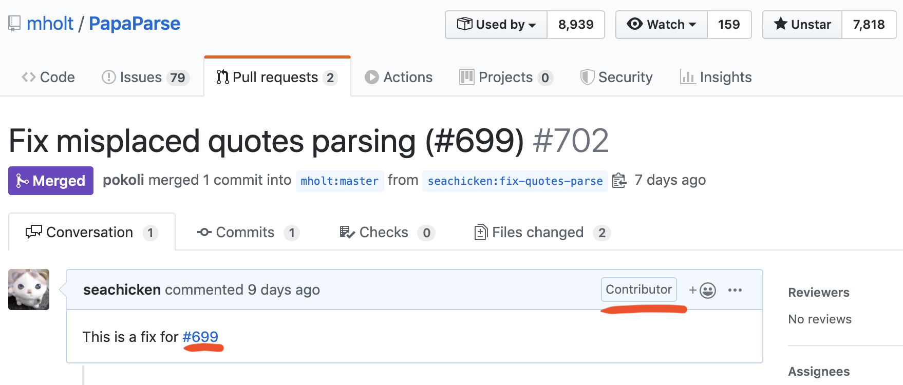
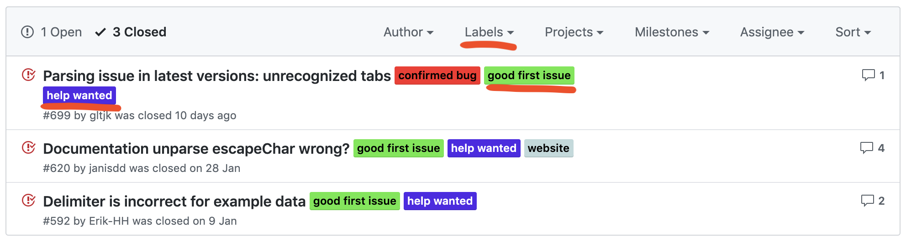
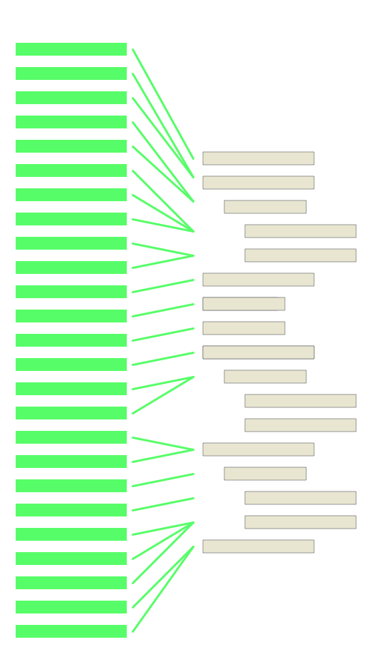
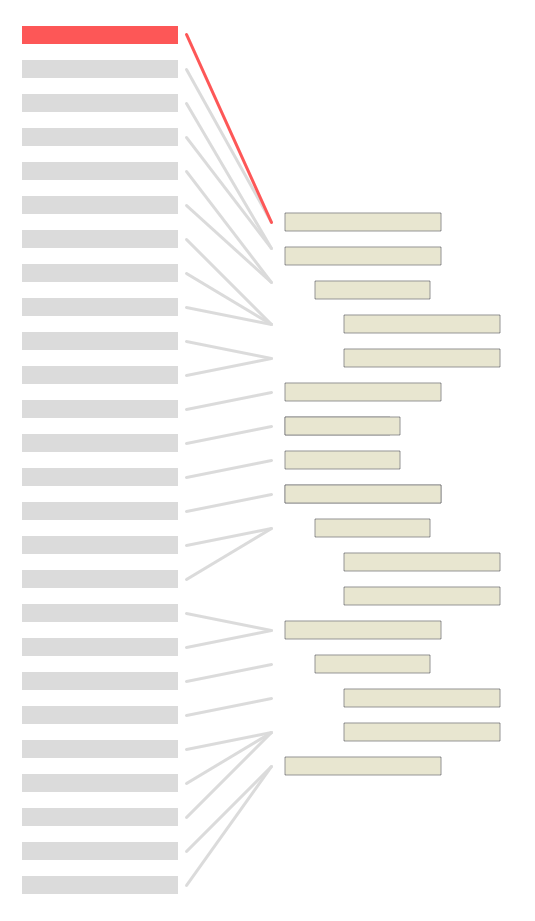

## OSSへのコミットTips

---

#### やったこと



@size[0.5em](PR: )[@size[0.5em](https://github.com/mholt/PapaParse/pull/702)](https://github.com/mholt/PapaParse/pull/702)

Note:
- 業務で使ったJS製のCSVパーサー
- 使っていて不具合があったからじゃなくて、何でもよかった
- クォートがある特殊な条件で不具合になるIssue

+++

@snap[north span-100 text-08]
#### 変更内容
@snapend

@diff[nofrags](mholt/PapaParse/d0a5feb340ddd90593cebeb31c769b6bd421dfe3)

@snap[south span-100]
@[9-10](プロダクションコードの修正は1行)
@[22-29](不具合をカバーするテストコードも追加)
@snapend

+++

@snap[north span-100]
#### good first issue でフィルタリング
@snapend



Note:
- 森さんが教えてくれた
- GitHubがデフォルトで用意している初心者向けのラベル
- good first issue
- help wanted

---

### Tip 1
### 🤔 正しい仕様が分からない

Note:
- PapaParseを例に役に立ったテクニックの紹介をする
- ドキュメントに記載がないレアケースの不具合

+++

@snap[north span-100]
#### Issueの内容
@snapend

@img[span-80](assets/img/issue.png)

+++

@snap[north span-100]
@img[span-80](assets/img/issue2.png)
@snapend

@snap[south span-100]
@ul[list-spaced-bullets]
- "a2" → a2  ✅
- a2"" → a2" ✅
- a2"  → ？
@ulend
@snapend

Note:
- 入力データに怪しいデータがある
- 入力ミスなので、エラーを返すかどうするか？

+++?code=assets/src/PapaParse/tests/test-cases.js&lang=js

@snap[north span-100]
#### テストコードから学ぶ
@snapend

@snap[south span-100]
@[124-132]("の入力ミスは許容するらしい！)
@ul[]
- a2"  → a2" ✅
@ulend
@snapend

Note:
- The quotes character is misplaced, but shouldn't generate an error or break the parser
- Issueの指摘は適切だった

---

### Tip 2
### 😕 読み辛いコード

+++

@snap[west span-70]
[parse関数](https://github.com/seachicken/PapaParse/blob/d0a5feb340ddd90593cebeb31c769b6bd421dfe3/papaparse.js#L1418)
変更が広範囲に影響するスコープが閉じてないコード
@snapend

@snap[east span-30]

@snapend

@snap[south span-100]
@css[fragment](OSSでわりと見かけるが何故崩壊しないの？)
@snapend

Note:
- JSの関数はオブジェクトなので関数を追加できる
- ローカルの関数のスコープも閉じてないし難解
- ジェンガをするように繊細な対応が必要か・・？

+++

@snap[west span-70]
テストコードで支えられているから
@snapend

@snap[east span-30]

@snapend

Note:
- ジェンガは多くのテストコードで支えられている
- `npm run test`
- 修正をしくじれば影響するテストが赤くなる
- 決して良いコードではないが、致命的な問題でもない

+++

@snap[north-west span-15]

@snapend

@snap[north span-70]
### 不具合にテストを書いて立ち向かう
@snapend

*最小レベルで不具合を再現させ、不具合が修正されたら通るような自動テストコードを書く*

@snap[south span-100]
[@size[0.6em](「t-wadaのブログ」より抜粋)](https://t-wada.hatenablog.jp/entry/debugging-tests)
@snapend

Note:
- Testabilityが高いコードはこういう戦い方ができる
- 最初から難解なコードを理解する必要はなく、先にテストを書くと効率が良い

+++

@snap[north span-100]
#### 最小で失敗するテストコードを追加
@snapend

@snap[west span-70]
@css[](1. Issueが提供したサンプルコード)
```js
const text = 'h1\th2\th3\na1\ta2"\ta3\nb1\tb2"\tb3';
const result = Papa.parse(text, { header: true }).data;
```

@css[](2. headerがない場合は？)
```js
const text = 'a1\ta2"\ta3\nb1\tb2"\tb3';
const result = Papa.parse(text).data;
```

@css[](3. "が1つの場合は？)
```js
const text = 'a1\ta2"\ta3';
const result = Papa.parse(text).data;
```
@snapend

@snap[east span-30]

@snapend

@snap[south span-100]
先にブラックボックスで問題領域を絞り込む
@snapend

Note:
- 1.はもちろんfail
- 2.でも同様のfail
- 問題領域を絞り込んでいく
- failするテスト1つが動くようにして、1秒くらいで結果を返させる
- デバッグログを追加してここのif文は無視していいなとか、動きを把握する

---

### Tip 3
### 😎 下手な説明よりコードで語れ

+++

@snap[north span-100 text-08]
#### PRの内容
@snapend

@img[span-70](assets/img/merge.png)

Note:
- PRでの説明はない
- 英語が得意ではないのも大きいが
- ある程度理に叶ったPR

+++

- 自動テストによりデグレなく問題が修正されたことは自明

- テストコードには仕様の明文化と自動テストを残す表現力がある

Note:
- a
  - 不具合が出るテストコードがプロダクションコードの修正で正常になる
- b
  - PRで頑張って説明しても検索しないと見れない情報なので埋もれる
  - 仕様を残して同じ不具合は二度と出さない
  - コーディングで語った方が利点が大きい

---

@snap[north span-100]
### まとめ
@snapend

- Tip1: テストコードで仕様が分かる

- Tip2: 読み辛いコードにはテストコードを書いてから戦う

- Tip3: 仕様化テストや自動テストなど最大限コードベースに価値を残す

Note:
- 読み辛くTestabilityの低いコードは崩れないように祈りながら修正するしかない

---

### 🍬 お・ま・け

+++

@snap[north span-70]
### オープンソースプロジェクトで夢を実現する
@snapend

*本当に自分の希望どおりのソフトウェアを作ることのできる立場にいる人は多くはないでしょう*

*本業に加え、自分がまさに興味を持っている技術分野での実務経験を積むことができるのです*

@snap[south span-100]
[@size[0.6em](「プログラマが知るべき97のこと」より抜粋)](https://xn--97-273ae6a4irb6e2hsoiozc2g4b8082p.com/%E3%82%A8%E3%83%83%E3%82%BB%E3%82%A4/%E3%82%AA%E3%83%BC%E3%83%97%E3%83%B3%E3%82%BD%E3%83%BC%E3%82%B9%E3%83%97%E3%83%AD%E3%82%B8%E3%82%A7%E3%82%AF%E3%83%88%E3%81%A7%E5%A4%A2%E3%82%92%E5%AE%9F%E7%8F%BE%E3%81%99%E3%82%8B/)
@snapend

Note:
- 「業務で」希望通りはなかなか
- コミュニティが大きければ優秀な人も多い
- 業務だけがスキルアップの場ではない、良いコードは開かれている
- 只、お金には一切ならない

